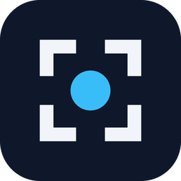

# ClearShot

A screenshot tool for Windows. Press a shortcut and the picture is copied to your clipboard and saved as a PNG. It can also record short GIFs, and lets you draw on a screenshot before you share it.

It runs entirely on your PC. There's no account, no upload and no network connection.

**[Download ClearShot.exe](https://github.com/hodlsharkai/clearshot/releases/latest)** (Windows 10 or 11, 64-bit). There's no installer: run the file and ClearShot sits in the system tray.

Windows may say it "protected your PC" because the app isn't code-signed. Click **More info**, then **Run anyway**.

## Shortcuts

| Shortcut | What it does |
|---|---|
| Alt + C | Captures the whole monitor your mouse is on. |
| Alt + Shift + C | Drag a box around the part you want. Esc or right-click cancels. |
| Alt + Shift + E | Drag a box, then draw on it before copying or saving (see below). |
| Alt + G | Records a GIF: drag a box, then press Alt + G again, Esc, or Stop to finish. Up to 15 seconds. |

All four can be changed in the ClearShot window (click the tray icon). Screenshots go to `Pictures\ClearShot` unless you pick another folder.

The screen keeps moving while you pick an area, so videos and streams don't pause.

## Drawing on a screenshot

Alt + Shift + E opens the area you picked with a bar of tools beside it. The rest of the screen stays live behind a dim layer.

| Tool | Key | Notes |
|---|---|---|
| Select | V | Click any drawing to move it, recolour it, resize it (scroll) or delete it (Delete). Drag the squares on an arrow's ends or a box's corners to reshape it. |
| Pen | P | Freehand. |
| Line / Arrow | L / A | |
| Rectangle | R | |
| Highlighter | H | See-through marker. |
| Text | T | Pick a font and bold from the Aa button. Drag the corner square to make it any size. Click finished text to edit it again. |
| Numbered steps | N | Click to drop 1, 2, 3... |
| Pixelate | B | Drag over names, emails or addresses to hide them. |
| Erase | X | Rubs out drawings and pixelation. Pixelate a box, then erase around the part that should stay hidden. |

- **Colour:** each tool remembers its own colour. Changing it also recolours the drawing you just made, or the one you've selected.
- **Thickness:** scroll to change it.
- **Undo:** Ctrl+Z undoes any change, one step at a time.
- **Moving the area:** drag its edges to resize it, or drag empty space with Select to move it.

Then choose what to do with it:

| Button | Key | |
|---|---|---|
| Copy and save | Enter | Same as the other shortcuts. |
| Copy | Ctrl + C | Clipboard only. |
| Save | Ctrl + S | File only. |
| Pin | | Floats the picture on top of your other windows. Drag to move, scroll to resize, double-click or Esc to close. |
| Close | Esc | Throws it away. |

## GIFs

- **Standard** (default): up to 960 px wide at 15 fps. Small files that suit Discord.
- **High:** up to 1920 px wide at 30 fps.
- **Also save an MP4:** a full-colour copy next to the GIF, much smaller. For game or video footage it looks far better, since a GIF is limited to 256 colours per frame.

The GIF is copied as a file, so pasting it into Discord uploads the animation rather than a still.

## HDR

On an HDR screen, screenshots are tone-mapped so they look the way they did on screen instead of washed out. You can also save true HDR copies alongside the normal PNG:

- **.jxr** opens in HDR in Windows Photos.
- **HDR PNG** (16-bit, HDR10) shows in HDR in Chrome and Edge.

The normal PNG is still what gets copied, because most apps can't show HDR. HDR copies don't include drawings.

## Privacy

ClearShot makes no network connections. Settings are kept in `%APPDATA%\ClearShot\settings.json` and a small diagnostic log in `%APPDATA%\ClearShot\clearshot.log`. Neither leaves your PC.

## Known limits

- Games in true exclusive fullscreen may minimise when an overlay or the editor opens. Borderless windowed is fine, and the full-screen shortcut never shows an overlay.
- Captures cover one monitor: the one under your mouse.
- Windows only.

## Building it yourself

You need the .NET 10 SDK.

```
dotnet test
dotnet publish src/ClearShot/ClearShot.csproj -c Release -r win-x64 --self-contained true -p:PublishSingleFile=true -p:EnableCompressionInSingleFile=true -o publish
```

`CLEARSHOT_LIVE=1` also runs the tests that capture the real screen. Pushing a tag such as `v1.4.0` makes GitHub Actions build, test and publish `ClearShot.exe` to Releases.

## Buy me a beer

ClearShot is free and has no ads. If it's useful to you, a tip is appreciated.

| Network | Address |
|---|---|
| Bitcoin (BTC) | `bc1qqz7xqmkgesmstyj40xadrf3szzfjdr2gx4u86y` |
| Ethereum (ETH, plus Base, Arbitrum, Optimism, Polygon and BNB Chain, and tokens like USDC and USDT on them) | `0xB78c5D07b6F957168998315E49210074Dc55F179` |
| Solana (SOL, USDC and other Solana tokens) | `TC3YtercaL9u6fVfDCpe6hxW48rzV4zg5DKi1vDjzuM` |

Only send each coin on its matching network. The same addresses, with QR codes, are under **Buy me a beer** in the ClearShot window.

## Licence

MIT

ClearShot uses [ImageSharp](https://github.com/SixLabors/ImageSharp) to choose GIF palettes, licensed to this open-source project under the Apache License 2.0 (Six Labors Split License), plus [Vortice.Windows](https://github.com/amerkoleci/Vortice.Windows) (MIT) and [QRCoder](https://github.com/codebude/QRCoder) (MIT).
